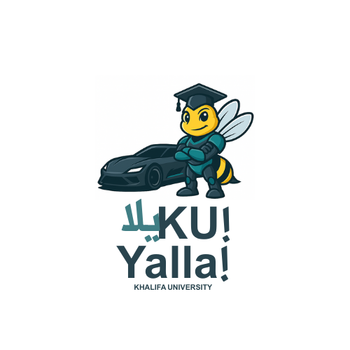

  

<h1 align="center">🏁 YallaKU, Yalla!</h1>
<h3 align="center">Autonomous Racing Team at Khalifa University</h3>

---

Welcome to **YallaKU, Yalla!** — a team of robotics innovators building cutting-edge autonomous racecars using the F1TENTH platform. We blend AI, real-time systems, and engineering to compete in global challenges and inspire the next generation of roboticists.

---

## 🔧 What We Do

- 🤖 AI-based obstacle avoidance and planning  
- 📍 SLAM and sensor fusion for localization  
- 🛠️ Modular ROS 2 stack and simulation tools  
- 🏎️ Track testing and sim-to-real deployment  

---

## 📢 We’re Recruiting!

🚨 **Apply now** to join one of the most exciting robotics teams on campus!  
We welcome new members in:

- Software (ROS 2, AI, SLAM)
- Hardware (vehicle, sensors)
- Simulation & testing
- Outreach & design

➡️ [Click here to apply](#)

> *YallaKU, Yalla! – where robots race, and students lead.*

